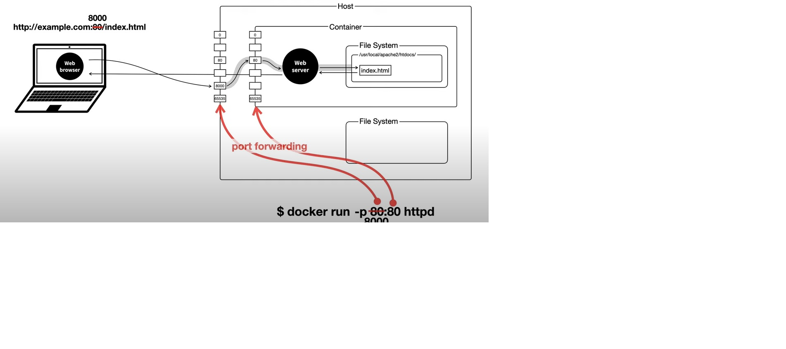

## 생활코딩 Docker 입구 수업

원래 Docker는 파이썬으로 만들어진 도구이다.
2013년 파이콘에서 처음 등장하게 됨

```bash
Docker위에서 돌아가는 contain, 또 그 container안에서 동작하는 app들은 Linux안에서 동작하는 app들이다.
운영체제가 Window나 MacOS라 한다면 컴퓨터에다 가상머신을 깔고 리눅스 운영체제를 깔면 리눅스 운영체제
안에서 위에 docker를 설치해 준다.
```

docker hub -> [pull] -> image -> [run] -> container

### image pull
docker pull httpd </br>
docker images </br>

### container run
docker run httpd </br>
docker run --name ws httpd </br>
docker stop ws </br>
docker start ws </br>
docker ps -a </br>
docker logs ws </br>
docker logs -f ws </br>
docker rm ws </br>
docker rm --force ws </br>
docker rmi httpd </br>



