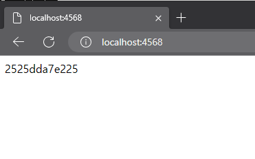

# T 아카데미 - 도커의 이해

# [1강] 도커 개요 및 소개

하드웨어 가상화 없이, 격리된 환경에서 실행되는 프로세스

컨테이너는 기본적으로 VM과는 다름

이미지 = 작동되는 상태

재현성

# [2강] 컨테이너 실행하기

도커는 linux만 지원. Windows에서는 실제로 가상머신에 설치됨.

shared drive 옵션은 WSL2 기반에선 필요 없음

- Hyper-V
    - 윈도우 2008부터 제공되는 가상화 솔루션
    - 가상화 기술을 사용할 수 있는 인프라 제공
- WSL2
    - Windows Subsystem for Linux
    - Windows10 2004버전부터 제공됨
    - 윈도우에서 리눅스의 쉘, 시스템을 사용할 수 있도록 지원하는 기능
    - Hyper-V를 사용한 경량 VM
- docker version
    
    C:\Users\onemo>docker version
    Client:
    Cloud integration: v1.0.35-desktop+001
    Version:           24.0.5
    API version:       1.43
    Go version:        go1.20.6
    Git commit:        ced0996
    Built:             Fri Jul 21 20:36:24 2023
    OS/Arch:           windows/amd64
    Context:           default
    
    Server: Docker Desktop 4.22.0 (117440)
    Engine:
    Version:          24.0.5
    API version:      1.43 (minimum version 1.12)
    Go version:       go1.20.6
    Git commit:       a61e2b4
    Built:            Fri Jul 21 20:35:45 2023
    OS/Arch:          linux/amd64
    Experimental:     false
    containerd:
    Version:          1.6.21
    GitCommit:        3dce8eb055cbb6872793272b4f20ed16117344f8
    runc:
    Version:          1.1.7
    GitCommit:        v1.1.7-0-g860f061
    docker-init:
    Version:          0.19.0
    GitCommit:        de40ad0
    
- ubuntu, centos
    
    C:\Users\onemo>docker run ubuntu:16.04
    Unable to find image 'ubuntu:16.04' locally
    16.04: Pulling from library/ubuntu
    58690f9b18fc: Pull complete
    b51569e7c507: Pull complete
    da8ef40b9eca: Pull complete
    fb15d46c38dc: Pull complete
    Digest: sha256:1f1a2d56de1d604801a9671f301190704c25d604a416f59e03c04f5c6ffee0d6
    Status: Downloaded newer image for ubuntu:16.04
    
    C:\Users\onemo>docker run --rm -it ubuntu:16.04 /bin/sh
    
    # ls
    
    bin  boot  dev  etc  home  lib  lib64  media  mnt  opt  proc  root  run  sbin  srv  sys  tmp  usr  var
    
    # exit
    
    C:\Users\onemo>docker run --rm -it centos:16.04 /bin/sh
    Unable to find image 'centos:16.04' locally
    docker: Error response from daemon: manifest for centos:16.04 not found: manifest unknown: manifest unknown.
    See 'docker run --help'.
    
    C:\Users\onemo>docker run --rm -it centos:7 /bin/sh
    Unable to find image 'centos:7' locally
    7: Pulling from library/centos
    2d473b07cdd5: Pull complete
    Digest: sha256:be65f488b7764ad3638f236b7b515b3678369a5124c47b8d32916d6487418ea4
    Status: Downloaded newer image for centos:7
    sh-4.2# ls
    anaconda-post.log  dev  home  lib64  mnt  proc  run   srv  tmp  var
    bin                etc  lib   media  opt  root  sbin  sys  usr
    sh-4.2# exit
    exit
    
- docker-workshop-app
    
    C:\Users\onemo>docker run -d -p 4568:4567 -e ENDPOINT=https://workshop-docker-kr.herokuapp.com/ -e PARAM_NAME=haha subicura/docker-workshop-app:2
    Unable to find image 'subicura/docker-workshop-app:2' locally
    2: Pulling from subicura/docker-workshop-app
    f49cf87b52c1: Pull complete
    ea5e933f2656: Pull complete
    16d8409825c1: Pull complete
    4b59fdedd8fc: Pull complete
    1e71a202b46b: Pull complete
    571bd1e469e9: Pull complete
    468a5e60a010: Pull complete
    0f5c2f85e269: Pull complete
    Digest: sha256:7cca0eb094ae589a241f3ab5022dc50a8d011ea95d7ad467a51747994e81896f
    Status: Downloaded newer image for subicura/docker-workshop-app:2
    2525dda7e225780d65ba93208f37227c7024d785abe2fc47e620efe6560ef961
    
    
    
- redis
    
    C:\Users\onemo>docker run --name=redis -d -p 1234:6379 redis
    Unable to find image 'redis:latest' locally
    latest: Pulling from library/redis
    52d2b7f179e3: Already exists
    689bed60e397: Pull complete
    2f34c7846499: Pull complete
    723b2c9888ad: Pull complete
    16acd9ca1349: Pull complete
    29771da5b50b: Pull complete
    Digest: sha256:c45b9ac48fde5e7ffc59e785719165511b1327151c392c891c2f552a83446847
    Status: Downloaded newer image for redis:latest
    c222d3ea43ddbb78ac8785216aba615eb5f5d94bb138bb8670311b19587b5293
    
    C:\Users\onemo>docker run --rm -it mikesplain/telnet docker.for.mac.localhost 1234
    Unable to find image 'mikesplain/telnet:latest' locally
    latest: Pulling from mikesplain/telnet
    Image [docker.io/mikesplain/telnet:latest](http://docker.io/mikesplain/telnet:latest) uses outdated schema1 manifest format. Please upgrade to a schema2 image for better future compatibility. More information at [https://docs.docker.com/registry/spec/deprecated-schema-v1/](https://docs.docker.com/registry/spec/deprecated-schema-v1/)
    c52e3ed763ff: Pull complete
    a3ed95caeb02: Pull complete
    Digest: sha256:11fa2b96776f5d34511452ad2b76eafad69321e456ac6653482eadb9d98c52a7
    Status: Downloaded newer image for mikesplain/telnet:latest
    keys *
    *0
    SET hello world
    +OK
    GET hello
    $5
    world
    
- mysql
    
    [mysql - Official Image | Docker Hub](https://hub.docker.com/_/mysql)
    
    C:\Users\onemo>docker run -d -p 3306:3306 -e MYSQL_ALLOW_EMPTY_PASSWORD=true --name mysql mysql:5.7
    Unable to find image 'mysql:5.7' locally
    5.7: Pulling from library/mysql
    70e9ff4420fb: Pull complete
    7ca4383b183f: Pull complete
    3e282e7651b1: Pull complete
    1ffa0e0ca707: Pull complete
    6eb790cf6382: Pull complete
    b4b277ff2929: Pull complete
    692fe4469429: Pull complete
    c0d447d97bbd: Pull complete
    99ee594517ba: Pull complete
    a9ae52de4d77: Pull complete
    66cc05a182b5: Pull complete
    Digest: sha256:2c23f254c6b9444ecda9ba36051a9800e8934a2f5828ecc8730531db8142af83
    Status: Downloaded newer image for mysql:5.7
    d45950714934a986d405efc033d0da096fc4decff7a41240a58572fe12f8aa30
    
    C:\Users\onemo>docker exec -it mysql mysql
    Welcome to the MySQL monitor.  Commands end with ; or \g.
    Your MySQL connection id is 2
    Server version: 5.7.43 MySQL Community Server (GPL)
    
    Copyright (c) 2000, 2023, Oracle and/or its affiliates.
    
    Oracle is a registered trademark of Oracle Corporation and/or its
    affiliates. Other names may be trademarks of their respective
    owners.
    
    Type 'help;' or '\h' for help. Type '\c' to clear the current input statement.
    
    mysql>
    

실행중인 컨테이너에 접속할 때는 보안 문제로 exec 명령어를 주로 사용함

- wordpress
    
    
    

docker ps

docker stop

docker rm

docker logs

docker images

docker pull

docker rmi

docker network create

도커 컨테이너 끼리의 통신

호스트의 IP 없이 컨테이너끼리 접속할 수 있는 가상의 네트워크

docker-compose.yml

run의 옵션을 설정 파일로 만들어 둘 수 있음

# [3강] 이미지 만들고 배포하기

이미지

특정 프로세스를 실행하기 위한 환경

계층화된 파일 시스템

파일들의 집합

docker diff

docker commit

이미지로 저장

- ubuntu:git
    
    C:\Users\onemo>docker run -it ubuntu:git bash
    root@8eadd8925232:/# git version
    git version 2.7.4
    

Dockerfile

docker build 마지막에 . 추가

FROM : 베이스 이미지 지정

FROM ubuntu:16.04

ADD : 현재 디렉토리 아래의 파일 추가

RUN : 명령어 실행

WORKDIR : 작업 디렉토리 변경

ENV : 환경변수 기본값 지정

EXPOSE : 컨테이너로 실행 시 노출시킬 포트

CMD : 기본 명령어 지정

- docker push/pull
    
    C:\Users\onemo\Desktop\B612DevOps스터디\Docker-WIL\one62>docker push one3/docker_tutorial:latest
    The push refers to repository [[docker.io/one3/docker_tutorial](http://docker.io/one3/docker_tutorial)]
    8a0650d520f3: Pushed
    54c4242f8c5c: Pushed
    1251204ef8fc: Mounted from library/ubuntu
    47ef83afae74: Mounted from library/ubuntu
    df54c846128d: Mounted from library/ubuntu
    be96a3f634de: Mounted from library/ubuntu
    latest: digest: sha256:409e7a3b469df6f2bd4a691ab98731adbf251da106b498e696708ba23409995d size: 1574
    
    C:\Users\onemo\Desktop\B612DevOps스터디\Docker-WIL\one62>docker pull one3/docker_tutorial
    Using default tag: latest
    latest: Pulling from one3/docker_tutorial
    Digest: sha256:409e7a3b469df6f2bd4a691ab98731adbf251da106b498e696708ba23409995d
    Status: Downloaded newer image for one3/docker_tutorial:latest
    [docker.io/one3/docker_tutorial:latest](http://docker.io/one3/docker_tutorial:latest)
    
    What's Next?
    View summary of image vulnerabilities and recommendations → docker scout quickview one3/docker_tutorial
    

# [4강] 도커 이미지 빌드 환경 만들기

CI/CD

Continuous Integration/Continuous Delivery

Jenkins

pipeline : stage별로 작업 관리

stage

pull

unit test

build

tag

push

deploy