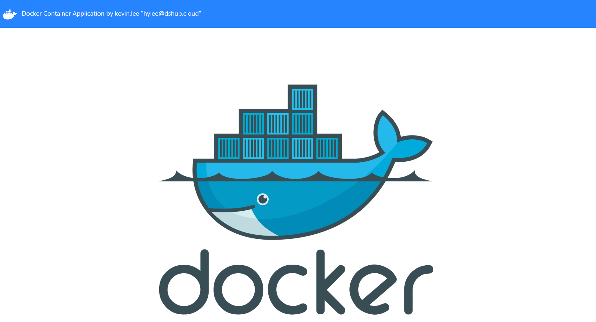

# 도커, 컨테이너 빌드업!

# 1장 클라우드 컴퓨팅

## 1.1 클라우드 컴퓨팅 개요

클라우드 컴퓨팅이란?

→ 인터넷 기술을 이용해서 다수의 사용자에게 하나의 서비스로서 방대한 IT 능력을 제공하는 컴퓨팅 방식

그리드 컴퓨팅 : 가상 네트워크를 이용하여 분산된 컴퓨팅 자원을 공유하도록 하는 기술 방식

유틸리티 컴퓨팅 : 다양한 컴퓨팅 자원에 대한 사용량에 따라 요금을 부과하는 종량제 방식의 기술 기반

비용보다도 서비스 가용성과 품질이 장점

## 1.2 컨테이너 기술과 도커

- 하이퍼바이저를 이용한 가상머신
    - 게스트 OS는 호스트 OS로부터 독립된 자원을 할당받음
    - 물리적 요소에 대한 가상화
- 컨테이너를 이용한 가상화
    - 프로세스 격리
    - 프로세스에 대한 가상화
    - 호스트 OS의 커널을 공유함

도커 : 컨테이너 엔진

## 1.3 쿠버네티스

쿠버네티스 : 컨테이너 오케스트레이션 도구

확장, 배포, 관리하는 작업 자동화

## 1.4 데브옵스

개발+운영

# 2장 도커 설치

## 2.4 도커 확인

`docker version`

`docker [system] info`

`docker system df`

`docker system events`

# 3장 컨테이너 서비스를 위한 도커 활용

## 3.1 컨테이너 서비스

애플리케이션 실행에 필요한 바이너리, 라이브러리, 구성 파일 등을 패키지로 묶어 배포하는 방식

→ 애플리케이션이 가지고 있는 운영체제, 하드웨어에 대한 의존성 문제 해결

운영체제 레벨 가상화(↔하드웨어 레벨 가상화)

**IaC**(Infrastructure as Code, 코드로서의 인프라스트럭처) : 컨테이너 동작에 필요한 모든 내용을 사전에 코드로 작성하여 인프라 프로비저닝 도구로 자동화하게 되면 필요할 때마다 애플리케이션 및 서버 환경을 적은 비용으로 빠르게 개발, 배포, 확장할 수 있다.

## 3.2 도커 명령어 활용

`docker [image] pull [OPTIONS] name[:TAG | @IMAGE_DIGEST]`

`docker image inspect [OPTIONS] IMAGE [IMAGE...]`

`docker image history [OPTIONS] IMAGE`

도커 컨테이너는 여러 레이어로 구성되어 필요한 이미지만 새로 내려받아 사용한다.

여러 컨테이너를 실행해도 별도의 읽고 쓰기를 위한 컨테이너 레이어가 상위에 추가되어 하위 이미지 레벨의 레이어에는 영향을 주지 않는다.

`docker tag 원본 이미지[:태그] 참조 이미지[:태그]`

원본 이미지에 참조 이미지 이름을 붙이는 명령

`docker login`

`docker logout`

`docker image save [옵션] <파일명> [image명]`

도커 이미지를 tar 파일로 저장

`docker image load [옵션]`

tar 파일을 이미지로 불러오기

`docker import`

`docker image rm [옵션] {이미지 이름[:태그] | 이미지 ID}`

`docker rmi [옵션] {이미지 이름[:태그] | 이미지 ID}`

`docker run~`

독립된 호스트 운영체제는 init 프로세스와 같은 최상위 부모 프로세스가 필요하다.

docker run 수행 시 PID 타임스페이스 커널 기능을 통해 시스템의 1번 프로세스의 PID를 공유하고 그 하위로 프로세스를 격리.

`[pull]` + `create` + `start` + `[command]`

`docker cp`

`docker commit`

도커 볼륨 : 필요한 데이터에 접근하고 공유하기 위한 기능

데이터와 로직 분리 가능

컨테이너가 종료되어도 데이터를 유지

volume

`docker volume create 볼륨 이름`

여러 컨테이너 간 공유

`--mount`나`--v` 등으로 볼륨 지정

bind mount

호스트 파일 시스템 절대경로: 컨테이너 내부 경로

도커 볼륨 기법에 비해 제한적

tmpfs mount

임시적. 컨테이너가 중지되면 유지되지 않는다.

CPU, 메모리, 디스크 IO 제약 옵션

제한하지 않으면 호스트 운영체제의 자윤을 자유롭게 사용한다.

도커 네트워크

docker0 : 도커 설치 시 기본적으로 제공되는, 소프트웨어적으로 구현된 가상 이더넷 브리지 네트워크. 윈도우에선 가상머신으로 실행되어 직접 접근 불가..?

`docker run` 사용 시 —net 옵션 혹은 `docker network` 명령으로 사용 가능

bridge : 기본 네트워크 드라이버. 별도의 네트워크 지정 없이 독립적으로 실행되는 앱 컨테이너 실행 시 사용.

host : 컨테이너와 호스트 간의 네트워크 격리를 제거하고 호스트의 네트워킹을 직접 사용.

브리지 모드에서 `docker run -p 8080:80` 옵션을 이용하면 컨테이너 포트 80이 호스트 포트 8080에 연결하여 실행된다.

`docker network create` 명령으로 사용자 정의 형태로도 사용 가능

특정 대역이나 IP도 지정 가능

자동화 DNS 확인 : 사용자 정의 네트워크 내에서 컨테이너명만으로도 서비스를 검색할 수 있는 내장 DNS 서버.

로드 밸런서 실습 내용 : 호스트 운영체제를 프록시로 설정하고 패킷을 연결된 컨테이너에 업스트림 가능. 각 컨테이너에서 웹 서비스를 실행.

`docker kill` 강제 종료

# 4장 컨테이너 환경 구성을 위한 Dockerfile 구성

## 4.1 코드로 개발하는 컨테이너 인프라, Dockerfile

특정 컨테이너를 위한 이미지를 개발할 때 필요한 설정 내용을 담은 파일. IoC 개념에서 출발한 기능. 프로그래밍형 인프라.

고려해야 할 요소

경량의 컨테이너 서비스

레이어 최소화

하나의 애플리케이션은 하나의 애플리케이션에

캐시 활용

상관없는 파일이 포함되지 않도록 별도의 디렉토리에서

서버리스

## 4.2 Dockerfile 명령어와 이미지 빌드

일반적으로 FROM 명령부터 작성

빌드 캐시의 무효화와 연관되므로 변경 빈도수가 적은 명령을 먼저 배치하는 것을 권장

`docker build`로 Dockerfile로부터 이미지 생성 가능

빌드 컨텍스트 : docker build를 실행하는, 현재 작업 중인 디렉토리. 이미지 빌드가 시작되면 현재 디렉토리에 있는 모든 파일과 디렉토리의 컨텐츠는 도커 데몬에 빌드 컨텍스트로 전달된다.

## 4.3 Dockerfile을 활용한 다양한 이미지 생성

- 실습 4-2
    
    PS C:\Users\onemo\Desktop\B612DevOps스터디\webapp2> docker build -t webapp:8.0 -f ./dockerfiles/Dockerfile .
    [+] Building 100.4s (9/9) FINISHED                                                                       docker:default
    => [internal] load .dockerignore                                                                                  0.0s
    => => transferring context: 2B                                                                                    0.0s
    => [internal] load build definition from Dockerfile                                                               0.0s
    => => transferring dockerfile: 318B                                                                               0.0s
    => [internal] load metadata for [docker.io/library/ubuntu:14.04](http://docker.io/library/ubuntu:14.04)                                                    0.0s
    => CACHED [1/4] FROM [docker.io/library/ubuntu:14.04](http://docker.io/library/ubuntu:14.04)                                                               0.0s
    => [internal] load build context                                                                                  0.0s
    => => transferring context: 36B                                                                                   0.0s
    => [2/4] RUN apt-get update && apt-get -y install apache2 vim curl                                               99.3s
    => [3/4] ADD webapp.tar.gz /var/www/html                                                                          0.0s
    => [4/4] WORKDIR /var/www/html                                                                                    0.0s
    => exporting to image                                                                                             0.8s
    => => exporting layers                                                                                            0.8s
    => => writing image sha256:28e22ebc821860f4fda843afc27b9aa0185fc0fb2de1b10b3af34da407bc0e51                       0.0s
    => => naming to [docker.io/library/webapp:8.0](http://docker.io/library/webapp:8.0)                                                                      0.0s
    
    What's Next?
    View summary of image vulnerabilities and recommendations → docker scout quickview
    PS C:\Users\onemo\Desktop\B612DevOps스터디\webapp2> docker image history webapp:8.0
    IMAGE          CREATED          CREATED BY                                       SIZE      COMMENT
    28e22ebc8218   29 seconds ago   CMD ["/bin/sh" "-c" "/usr/sbin/apachectl -D …   0B        buildkit.dockerfile.v0
    <missing>      29 seconds ago   EXPOSE map[80/tcp:{}]                            0B        buildkit.dockerfile.v0
    <missing>      29 seconds ago   WORKDIR /var/www/html                            0B        buildkit.dockerfile.v0
    <missing>      29 seconds ago   ADD webapp.tar.gz /var/www/html # buildkit       197kB     buildkit.dockerfile.v0
    <missing>      29 seconds ago   RUN /bin/sh -c apt-get update && apt-get -y …   67.6MB    buildkit.dockerfile.v0
    <missing>      29 seconds ago   LABEL purpose=container web application prac…   0B        buildkit.dockerfile.v0
    <missing>      29 seconds ago   MAINTAINER "onemo"                               0B        buildkit.dockerfile.v0
    <missing>      2 years ago      /bin/sh -c #(nop)  CMD ["/bin/bash"]             0B
    <missing>      2 years ago      /bin/sh -c mkdir -p /run/systemd && echo 'do…   7B
    <missing>      2 years ago      /bin/sh -c [ -z "$(apt-get indextargets)" ]      0B
    <missing>      2 years ago      /bin/sh -c set -xe   && echo '#!/bin/sh' > /…   195kB
    <missing>      2 years ago      /bin/sh -c #(nop) ADD file:276b5d943a4d284f8…   196MB
    PS C:\Users\onemo\Desktop\B612DevOps스터디\webapp2> docker run -itd -p 8008:80 --name=webapp08 webapp:8.0
    e3513108d8cb61f59f9d4117a677448f27b630b42126154806906a063d892338
    

다단계 빌드 : FROM 명령을 이용해 여러 단계의 빌드 과정을 만들고, 다른 단계에 AS를 이용해 이름을 부여할 수 있다.

다른 단계에서 생성된 결과 중 필요한 데이터만 가져올 수 있다.

예제 : (두 번째 단계에서) `COPY —from=첫 번째 단계 이름`

하나의 이미지로 의존성이 있는 2개의 이미지를 연결하여 경량화된 이미지를 생성할 수 있다.

## 4.4 깃허브를 활용한 Dockerfile 코드 공유

유료 계정이면 도커 허브와 깃허브를 연결해 자동화된 이미지 빌드 가능함

## 4.5 개별 이미지 저장을 위한 프라이빗 레지스트리 구성

registry 이미지를 실행하고 그 안에 이미지를 로컬에 저장할 수 있다.

컨테이너를 실행하고 그 주소로 push, pull 가능

`docker push IP:port/이미지 이름`

# 5장 도커 컴포즈 도구를 이용한 다중 컨테이너 애플리케이션 서비스 배포

공통성을 갖는 컨테이너 애플리케이션 스택을 야믈 코드로 정의하고 실행하기 위한 다중 컨테이너 실행 도구.

## 5.1 도커 컴포즈

윈도우에서는 Docker for windows를 설치할 때 도커 엔진과 같이 설치된다.

`docker-compose up` 명령어 실행 시 자체 기본 네트워크가 생성된다.

```
.
├── docker-compose.tml
├── mydb
|   └── Dockerfile
└── myweb
    ├── Dockerfile
    └── index.html
```

위와 같은 구조로 컨테이너가 실행되고 있다면, myweb 서비스와 mydb 서비스는 자동으로 생성된 자체 네트워크에 함께 할당되어 서비스를 시작하게 되고, mydb 서비스가 myweb 서비스에 ping 명령을 수행하면 서비스가 포함된 내부 네트워크와 IP 정보를 출력한다. 동일 네트워크에 포함되므로 API 통신이 쉬움.

docker-compose.yml

```yaml
version: "3.8"
services:
	서비스명1:
		#애플리케이션 설정값 정의1
	서비스명2:
		#애플리케이션 설정값 정의2
...
networks:
	#네트워크 설정. 미지정 시 자동 생성
volumes:
	#볼륨 설정
```

위에서 아래로 처리되는 직렬 구조. 설계상 먼저 실행되어야 하는 애플리케이션을 먼저 작성한다.

Dockerfile을 이용한 build 후 실행도 가능.

도커 컴포즈는 개발 및 테스트 단계에 적합한 도구. 실제 운영에서는 쿠버네티스나 도커 스웜 등을 이용하여 관리적 측면까지 고려해야 함.

# 6장 AWS 클라우드를 이용한 컨테이너 서비스 배포

## 6.2 AWS 클라우드 EC2 + Docker + ECR 구성해 보기

1. EC2 인스턴스 생성 후 접속(putty)
2. 서버에 도커 설치
3. 깃 설치 후 실습용 예제 다운로드
4. dockerfile 작성, 빌드, 실행
5. EC2 인바운드 규칙 설정
6. 접속



1. IAM 계정 생성
    1. 자격증명 작업
2. ECR 저장소 생성
3. 이미지 업로드 후 확인


## 6.3 AWS 클라우드 ECS 구성 워크숍

ECS : AWS의 완전 관리형 컨테이너 오케스트레이션 서비스

컨테이너 관리 방식 지정 → 작업 정의 구성(도커 컨테이너 애플리케이션을 위한 템플릿 구성) → 클러스터 구성 → 아마존 ECS 서비스 구성 → 서비스 확인

### 사용자 관점의 설계 설명

1. Admin
    1. 관리자는 ECS를 EC2 + 네트워크 기반의 클러스터로 구성
    2. 개발환경을 AWS Cloud9 개발 도구를 이용해 작업
    3. ECR 저장소에 서비스 환경인 Nginx와 Django 도커 이미지를 저장
    4. ECS 작업정의서 작성
    5. ECS 서비스를 통해 애플리케이션 로드 밸런서 기반으로 각 서비스 분산 배치
2. Users
    1. 사용자는 인터넷 게이트웨이 → 애플리케이션 로드 밸런서를 통해 Nginx 웹 서비스 접근
    2. 애플리케이션 로드 밸런서는 사용자의 요청을 부하율을 고려하여 분산 배치 수행
    3. 내부 서비스에서의 외부 데이터 요청을 NAT 게이트웨이를 통해 수행
    4. 요청의 회신은 사용자 접근 처리와 동일하게 인터넷 게이트웨이를 통해 수신

### 인프라 구성

1. VPC, 서브넷(public 2, private 2), 인터넷 게이트웨이, NAT 게이트웨이, 라우팅 테이블 생성


1. 보안 그룹 생성
ALB가 외부의 HTTP 요청을 수신하기 위한 보안 그룹,
ECS에서 생성한 웹 서비스 인스턴스가 ALB로부터 오는 트래픽만 수신하기 위한 보안 그룹
2. 애플리케이션 로드 밸런서 생성

### AWS Cloud9 도구를 이용한 개발 환경 구성

1. IAM 역할 만들기
Cloud9 환경에서 사용하는 EC2 인스턴스가 ECR에 접근해 컨테이너 이미지를 올릴 수 있도록
2. Cloud9 환경 생성
3. 설정

### 도커 이미지 저장소 ECR 구성

[846573433984.dkr.ecr.us-west-2.amazonaws.com](http://846573433984.dkr.ecr.us-west-2.amazonaws.com/)

1. 저장소(django, nginx) 생성
2. 도커 이미지 빌드
[brayanlee/jpub-ecs: Docker, container build-up books, ECS (github.com)](https://github.com/brayanlee/jpub-ecs)
`docker build .`
3. 도커 이미지 업로드
repositoryUri 정보 필요함

### ECS 환경 구성

1. ECS 클러스터 생성
2. ECS 작업 정의 생성
3. ECS 서비스 생성

### 웹 서비스 배포 테스트


왜죠

로컬에서 빌드하고 실행해봤으나 같은 화면이 나왔습니다…


뭔가 경로에 오류가 있었던 것 같아요